Visualization tool (croco_pyvisu)
=================================

Croco_pyvisu is a tool written in python to visualize history files genarated by 
the Croco model.

Setup your Miniconda environment
--------------------------------

* Download and install miniconda: download Miniconda from 
  the `Conda website <https://docs.conda.io/en/latest/miniconda.html>`_. 
  See the documentation for installation.

* Put the path in your shell environment file (ex:.cshrc, .bashrc) 

  ::

    source path_to_your_miniconda/etc/profile.d/conda.csh

* Create your conda croco_pyvisu environment 

  ::

    conda update conda
    conda create -n croco_pyvisu -c conda-forge python=3.7 wxpython xarray matplotlib netcdf4 scipy ffmpeg
    conda activate croco_pyvisu

Croco_pyvisu directory
----------------------

The ``croco_pyvisu`` directory is provided in the CROCO_PYTOOLS.   
Clone the croco_pytools git:

::

    git clone https://gitlab.inria.fr/croco-ocean/croco_pytools.git

    cd croco_pytools/croco_pyvisu/

Install croco_pyvisu in the conda environment (command launched in the croco_pyvisu directory)

::

    pip install -e .

First, you have to customize for your own history files
-------------------------------------------------------

The only file you have to change is the file *croco_wrapper.py*. 
You have two files as examples in the repository:

* croco_wrapper.py.benguela for the Benguela test case, where history files 
  are created through the classic method.
* croco_wrapper.py.moz where the history files are created through XIOS.

Choose the right one to start :

::

  cp croco_wrapper.py.benguela croco_wrapper.py

In croco_wrapper.py, change ``path`` and ``keymap_files`` to load the right files

::

  path = "./"
  keymap_files = {
    'coordinate_file': path + "croco_his_Y2008.nc",
    'metric_file': path + "croco_his_Y2008.nc",
    'mask_file': path + "croco_his_Y2008.nc",
    'variable_file': path + "croco_his_Y2008.nc"
  }

* coordinate_file : containing lon_r, lat_r, time
* metric_file : containing pm, pn, theta_s, theta_b, Vtransform, hc, h, f
* mask_file : containing mask_rho
* variable_file : containing ssh, u, v, w, temp, salt, rho

Change the ``keymap_*`` dictionnaries to suit your files, you must only change the keys, 
that is the values on the left before the ":"

::

  keymap_dimensions = {
      'xi_rho': 'x_r',
      'eta_rho': 'y_r',
      'xi_u': 'x_u',
      'y_u': 'y_r',
      'x_v': 'x_r',
      'eta_v': 'y_v',
      'x_w': 'x_r',
      'y_w': 'y_r',
      's_rho': 'z_r',
      's_w': 'z_w',
      'time': 't'
  }

  keymap_coordinates = {
      'lon_rho': 'lon_r',
      'lat_rho': 'lat_r',
      'lon_u': 'lon_u',
      'lat_u': 'lat_u',
      'lon_v': 'lon_v',
      'lat_v': 'lat_v',
      'scrum_time': 'time'
  }

  keymap_variables = {
      'zeta': 'ssh',
      'u': 'u',
      'v': 'v',
      'w': 'w',
      'temp': 'temp',
      'salt': 'salt',
      'rho': 'rho'
  }

  keymap_metrics = {
      'pm': 'dx_r',
      'pn': 'dy_r',
      'theta_s': 'theta_s',
      'theta_b': 'theta_b',
      'Vtransform': 'scoord',
      'hc': 'hc',
      'h': 'h',
      'f': 'f'
  }

  keymap_masks = {
      'mask_rho': 'mask_r'
  }
  
Launch visualization
--------------------

To start croco_visu:

::

  croco_gui_xarray.py

The main window is opened.

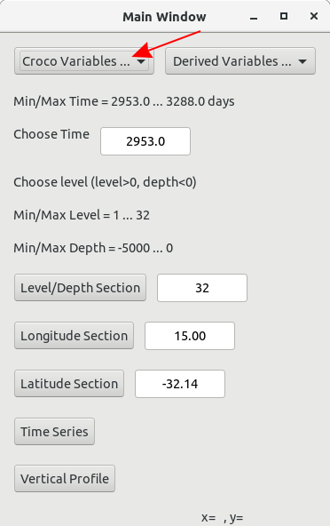

First, you have to choose a variable through the *Croco Variables...* menu, which list all 
the 2D/3D variables of the history file.

Min/max Time of the file are filled out
You can type a time in the *Choose Time* input box. The nearest time of the history file will be retrieved.

.. warning::

    Each time you type something in an input text box, you must 
    validate the input with the "Enter" key.

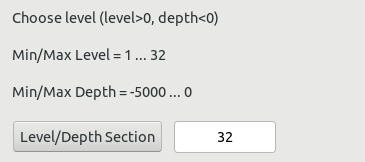

Min/max level and min/max depth of the file are indicated
You can type a level or depth in the input level/depth box (>0 means level, <=0 means depth), by default, 
the value is the highest level

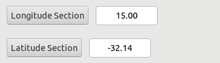

You can type a longitude/latitude in the input longitude/latitude box (default is the mean longitude/latitude) 

Now you can click on the *Level/Depth Section* button and a new window appears.

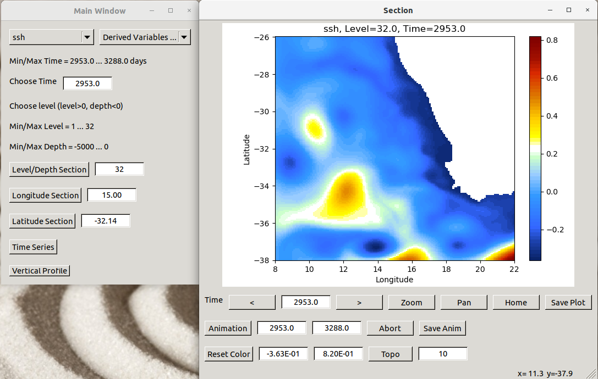

In this new window, you can only plot the current variable at the current level/depth. 
If you want another variable, or another level/depth, you have to choose first another variable 
or another level/depth and click again on the Level/Depth Section button. 
Then you will have another new window.

This new window offers several buttons and information:

To change the current time, you can type a new time in the text box or use the arrows

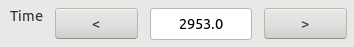

To zoom, translate and save the plot  

* To zoom, you have to first click the *Zoom* button and after select the region to zoom.  
* To translate the plot, you have to first click the *Pan* button and then move the plot  
  with the left mouse button.  
* The Home button is to go back to the default view.  
* The Save Plot button will open a new window for you to save the current plot.  

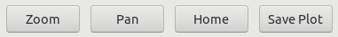

To create animations  
You have first to choose the start time and the end time in the two input text boxes.  
Then you can click on the "Animation" button to start the animation.  
You can abort the animation with the "Abort" button . 
If you select the "Save Anim" button, your animation is saved in a  "Figures" sub-directory.

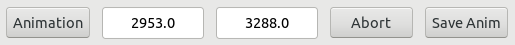

To change the colorbar  
To choose new limits for the colorbar (return to validate the input).
You can go back to the default colorbar with the "Reset Color" button.

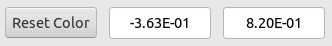

To show contours of the topography.  
You can show the contours of the topography by clicking on the  "Topo" button (on/off).  
You can change the number of contours shown in the text input box (return to validate the input, default is 10).

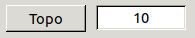

To see the coordinates of the current point.  
At the right bottom corner of the window, you have the coordinates of the cursor.

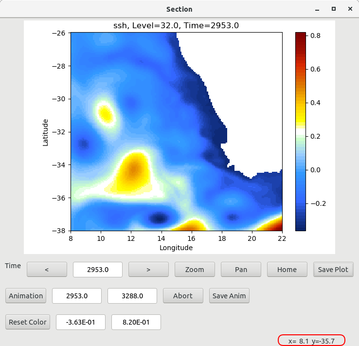

On the main window, the two others buttons *Longitude Section* and *Latitude Section* will 
open the same kind of window than the *Level/Depth Section* but at a given longitude or latitude. 

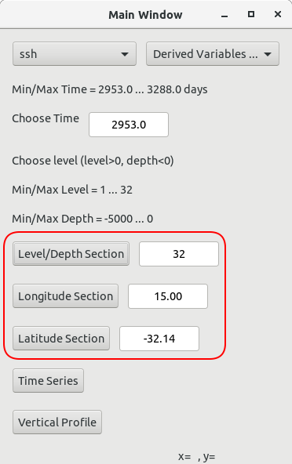

Of course, to have a longitude/latitude section, you must choose a 3D variable.  
You have to choose first the longitude/latitude before clicking the buttons. 
The longitude/latitude can be typed in the text input boxes near the buttons, 
or you can click on a plot to select a new point. If you click on the plot of a

* *Level/Depth Section*, you select new longitude and latitude.
* *Longitude Section*, you select new depth and latitude.
* *Latitude Section*, you select new depth and longitude.

The two last buttons of the main window *Time Series* and *Vertical Profile* 
create new windows to plot curves.

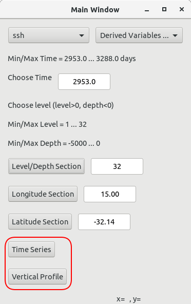

Both *Time Series* and *Vertical Profile* have the same possibilities.

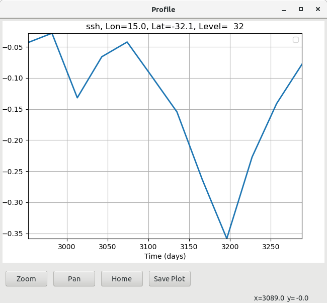

* *Zoom* a part of the curve: you must first select the *Zoom* button and then select the region to zoom.

* *Pan* the curve: you must first select the *Pan* button and then translate the curve.

* *Home* to go back to the default view

* *Save Plot* : when you click on the *Save Plot* button, a popup window is opened for you to choose the name of the file.

The time series is plotted at the current level/depth, longitude and latitude. 
The vertical profile is plotted at the current longitude/latitude.  
You also have the coordinates of the cursor at the right bottom of the window.

How to add new variables
------------------------

In the main window, you have another menu called *Derived Variables...*, which contains 
calculated variables, derived from the base fields found in the history file.

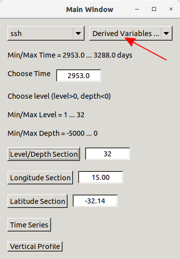

Right now, available variables are

* pv_ijk
                          
  Ertel potential vorticity is given by 
    
  .. math::
    
    \frac{curl(u) + f}{rho}

* zeta_k

  zetak is given by  
  
  .. math::
    
    \frac{\partial{v}/\partial{x} - \partial{u}/\partial{y}}{f}

* dtdz

  dtdz in given by 

  .. math::
    
    \frac{\partial{T}}{\partial{z}}

* log(Ri)

  Ri is given by 
  
  .. math::

    \frac{N²}{(\partial{u}/\partial{z})² - (\partial{v}/\partial{z})²} 
    
  with

  .. math::

    N=\sqrt{\frac{-g}{rho0} * \frac{\partial{rho}}{\partial{z}}}

You can add new variables by:

* in the file *CrocoXarray.py*, add a line in the method *list_of_derived*:

::

    def list_of_derived(self):
    ''' List of calculated variables implemented '''
    keys = []
    keys.append('pv_ijk')
    keys.append('zeta_k')
    keys.append('dtdz')
    keys.append('log(Ri)')
    return keys

* in the file *derived_variables.py*, add two functions *get_newvar* and *calc_newvar*
  to calculate the new variable

* in the file *croco_gui_xarray.py*, add the calls to the new function *get_newvar* 
  in *updateVariableZ*, *onTimeSeriesBtn* and  *onVerticalProfileBtn*
