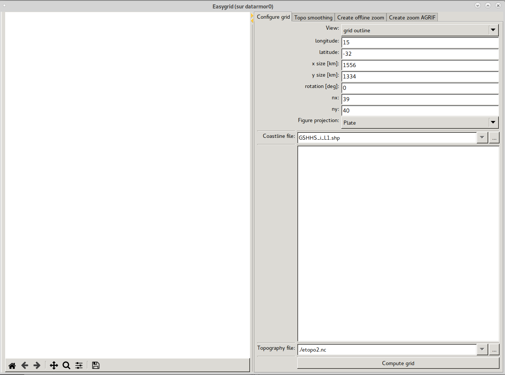
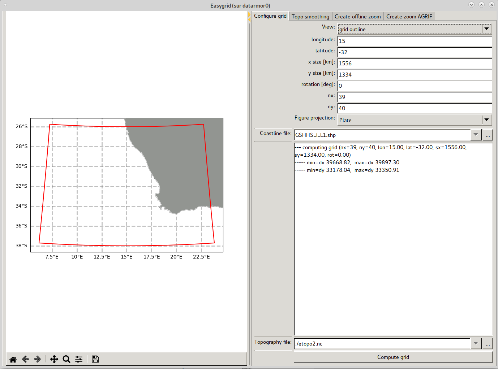
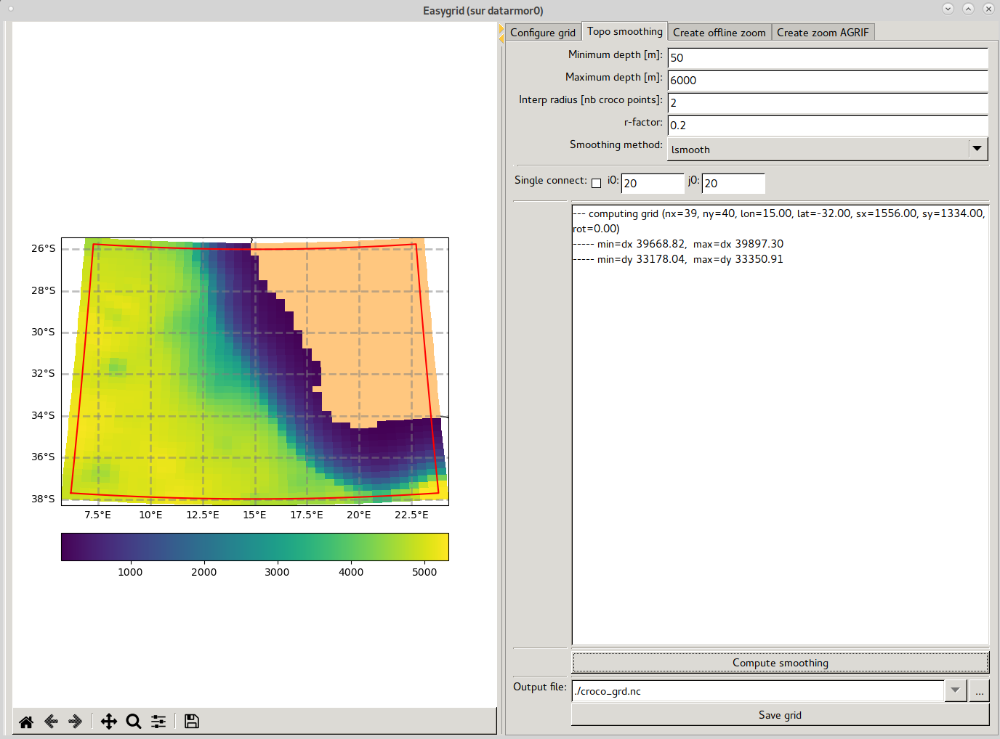

Build CROCO grid
----------------

The first step when creating a configuration is to build the grid on the 
region of interest. 
The other steps (initial, boundary conditons...) are grid dependent, they
will use the CROCO grid file.
The routine to use to create a grid is ``make_grid.py``. 

Description of make_grid
^^^^^^^^^^^^^^^^^^^^^^^^

``make_grid.py`` is the routine to build your configuration grid over your area of interest. It
performs the following steps:

* Place and define the grid around the chosen location
* Interpolate the bathymetry on the CROCO grid
* Build the landmask
* Smooth the bathymetry according to chosen criteria

A graphic interface can be used to facilitate the grid positionning, but the routine can also be used without it.
  
.. note::
 
  On distant computers, like HPC clusters, the graphic interface can be quite slow, 
  especially if using a VPN. 

Grid positionning
"""""""""""""""""

Grid construction is based on different parameters, which can be found in 
the ``User changes`` section of the ``make_grid`` routine.

.. list-table::

  * - tra_lon 
    - Longitude of grid center 
  * - tra_lat 
    - Latitude of grid center
  * - size_x, size_y 
    - Grid size [km] in x and y directions
  * - nx, ny
    - Number of points in x and y directions
  * - rot
    - Rotation angle of the grid [degree], 0: x direction is towards east

The user specifies the grid center and its size in both x and y directions.
The grid resolution is given by dividing the domain 
size by the number of point in each direction. 
The routine is currently designed to create a 
rectangular, orthogonal grid with minimal gridsize variation. It uses a 
Mercator projection around the equator and then rotates the sphere around 
its three axes to position the grid wherever it is located. 

Mask creation
"""""""""""""

Mask creation is handled by the python library
`regionmask <https://regionmask.readthedocs.io/en/stable/>`_ and can handle any
shapefile to define it.

.. list-table::

  * - shp_file
    - Coastline shapefile (for the mask)

CROCO can manage wetting and drying process in coastal
areas, in this case the land/sea boundary in CROCO should be extended further than
the usual coastline. 

In that case, the coastline data will be ignored, and the topography data
will be used instead. The minimum depth, ``hmin``, thus needs to be set
to a value lower than zero. The mask will be drawn at ``hmin`` altitude.

.. warning::

  To ensure correct landmask in wet and drying case, it is recommended to 
  use topographic data with continuity on land.

In some cases, mask generation can leave water bodies inside the land
(lakes for example) which are not connected to the main water body.
If not wanted, the isolated water bodies can be masked using the ``single_connect``
functionnality. It takes a user-specified initial point, which is assumed
to be in the main water body and, starting from this point, considers
the adjacent non-masked points as "water". Extending further, non-masked point are also
marked as "water" if at least one its neighbouring points is already marked as "water".
At the end, remaining non-connected water bodies, not marked as "water", because not
connected to the main water body, are masked.

To use this functionnality you can set in ``make_grid``:

 ::

    sgl_connect=[True,i0,j0] 

Where the argument are:

.. list-table::

  * - True/False
    - Activate/Deactivate functionality
  * - i0
    - Index of the starting point (in the water main body) in x-direction
  * - j0
    - Index of the starting point (in the main water body) in y-direction

Bathymetry interpolation and smoothing
""""""""""""""""""""""""""""""""""""""

The parameters to fill in the ``make_grid`` routine regarding bathymetry treatment are:

.. list-table::

  * - hmin
    - Minimum depth [m] used at the shore (depends on the resolution, a few examples : dx=100km, hmin=300, dx=25km, hmin=150, ...). This affects the smoothing which works on grad(h)/h.
  * - hmax
    - Maximum depth [m]. Note: this limits the bathymetry to prevent extrapolations of input data below available levels
  * - interp_rad
    - Interpolation radius in number of points of the CROCO grid (usually between 2 and 8)
  * - rfact
    - Maximum slope parameter, r-fact = grad(h)/h, to be reached when smoothing (the lower it is, the smoother it will be)   
  * - smooth_meth 
    - Smoothing method to use. Available options are: 'smooth', 'lsmooth', 'lsmooth_legacy', 'lsmooth2', 'lsmooth1', 'cond_rx0_topo'. See details below. 
  * - topofile
    - Source topography/bathymetry file

Bathymetry interpolation from the source bahtymetry grid to the CROCO grid 
is performed using weighted averaging.
Weights are computed with a Hann window and more precisely with its polynomial fit 
(less costly). When input data is coarser than CROCO grid and no data is 
found in the radius window, a bi-linear interpolation is performed with the 
four closest points.

Since CROCO is a sigma-coordinate model, it is sensitive
to pressure gradient errors. Although these are accounted for and reduced by the numerical methods 
used in the model, it is however necessary to smooth the bathymetry so that the slope
is everywhere less than a defined r-factor. The default value for
r-factor is set to 0.2 but can be changed by the user. The lower the value,
the smoother the topography.

Before smoothing, routine uses ``hmin`` and ``hmax`` to bound topography
before smoothing. Topography values lower than hmin, repectively higher
than hmax, will be set to hmin, repectively hmax.

Then smoothing is performed. Several smoothing methods exists in CROCO,
which can be divided into two categories:

  - rx-condition
  - Log-smooth

The first category is smoothing the raw topography until the slope criterion
is met. The second category transforms the topography into its logaritm
and smoothes it. Here is a brief description of each available smoothing method:

.. list-table::
  :widths: 30 70

  * - smooth 
    - Mask-dependent r-factor based on rx-condition, using Neumann boundary condition
      at the coastline.
  * - lsmooth
    - Mask-dependent r-factor based on log_smooth condition
  * - lsmooth2
    - Same as lsmooth, but instead of explicitly computing diagonal fluxes 
      apply cross-averaging to 90-degree fluxes
  * - lsmooth1
    - Same as lsmooth, but without diagonal fluxes
  * - lsmooth_legacy
    - Same as lsmooth but mask independant
  * - cond_rx0_topo
    - It compares pair-wise adjacent points in either X or Y direction 
      and if r-factor exceeds the prescribed maximum, 
      the shallower depth between the two points is increased so that
      r-factor remains within the limit. Because of inter-dependency among the 
      points the process is repeated iteratively.

.. note::

  To avoid errors close to the coastline, it is better to choose data with 
  continuity on land.

Using make_grid
^^^^^^^^^^^^^^^

This section will guide you in a tutorial for using ``make_grid`` to build a CROCO grid. 
Topography used in this tutorial is the **etopo2** data, and **gshhs** coastline data that are available in the provided ``DATASETS_CROCOTOOLS`` that can be downloaded from this page: 
`download section <https://www.croco-ocean.org/download/>`_. 

.. note::

    Readers for this tutorial should already be correctly filled. 
    For using different data sources, you may have to edit the Readers/topo_reader.py.
    Please refer to "Reader" section for more details.

1. Activate your python environment:

::

  conda activate croco_pyenv

or 

::

  mircomamba activate croco_pyenv

2. The first section "**USER CHANGES**" of ``make_grid.py`` is where you should provide the relevant information for your grid:

::

  #--- USER CHANGES ---------------------------------------------------------

  # Grid center [degree]
  tra_lon =  15 # Longitude of the grid center 
  tra_lat = -32 # Latitude of the grid center
  
  # Grid size [km]
  size_x = 1556
  size_y = 1334
  
  # Grid number of points 
  # Note: grid resolution is grid size / number of points
  nx = 39
  ny = 40
  
  # Grid rotation [degree]
  rot = 0
  
  # Smoothing parameters
  # (see online documentation for more details)
  hmin        = 50    # Minimum depth [m]
  hmax        = 6000  # Maximum depth [m]
  interp_rad  = 2     # Interpolation radius in number of points (usually between 2 and 8)
  rfact       = 0.2   # Maximum r-fact to reach (the lower it is, the smoother it will be)    
  smooth_meth = 'lsmooth' # Smoothing method ('smooth', 'lsmooth', 'lsmooth_legacy', 'lsmooth2', 'lsmooth1', 'cond_rx0_topo') 
  
  # Topo/Bathy file
  topofile = '../../DATASETS_CROCOTOOLS/Topo/etopo2.nc'
  
  # Coastline file (for the mask)
  shp_file = '../../DATASETS_CROCOTOOLS/gshhs/GSHHS_shp/i/GSHHS_i_L1.shp'
  
  # Single Connect [Mask water not connected to the main water body]
  sgl_connect=[False,20,20] # True or False, point indices inside the main water body
  
  # Output grid file
  output_file="../../CROCO_FILES/croco_grd.nc"

  #--- END USER CHANGES -----------------------------------------------------

.. note::

  ``make_grid`` can either directly process the grid with settings provided here, 
  or open a graphic interface in which you will be able to modify all these settings
  and have a view of the domain, and various steps (grid positionning, smoothing...) 
  before saving the grid. 

3. Launch ``make_grid.py``:

::

  python make_grid.py

4. A question is raised:
    
::

  Do you want to use interactive grid maker ?
  (e.g., for grid rotation or parameter adjustments) y,[n]:
   

Answer ``n`` to directly process the grid, or ``y`` to open the graphic interface. 

5. If you have answer ``y``, a graphic interface will appear:

    Entrance window of ``make_grid``

This window is devided in several tabs each having a specific objective:

.. list-table::

    * - Configure grid
      - Handle grid position, number of points,...
    * - Topo smoothing
      - Parameter to smooth grid defined in previous tab
    * - Create offline zoom
      - Handle child grid for offline zoom
    * - Create zoom AGRIF
      - Handle child grid with AGRIF

.. note::

    Parameters defined at window opening are those specified in ``make_grid.py``

.. warning::
  
    Changing parameters in the interface will not update default parameters 
    in ``make_grid.py``, be sure to save your grid (second tab) to keep 
    track of your grid tests.

6. **Configure grid** tab:

Eventually edit the parameters and paths towards the Coastline and Topography files and press the ``Compute grid`` button to have a first guess of your grid:

    Grid outline

Several variables (grid points, dx, dy, mask...) can be displayed, see the **View** menu. 
Press ``Compute grid`` to validate your choice and update the plot. 

If you are working around pole, you can also modify figure projection 
to fit better.

7. **Topo smoothing** tab:

Then choose the smoothing parameters and methods.

Press ``Compute smoothing`` to perform interpolation and smoothing. 

    Display of topography after smoothing

You can also use the ``Single connect`` functionnality to mask lakes or unwanted water bodies that are not connected to your main water body. See details in the **Mask creation** description section above.

Finally, edit the path and filename of your CROCO grid, and press ``Save grid`` to save it.

Your grid is now ready to be used by CROCO. Informations used to create the 
grid are available as global attributes in the crated netcdf, 
you can chek them with:

::

  ncdump -h croco_grd.nc

  [...]
  
  created = "2024-01-30T12:38:02.284335" ;
  type = "CROCO grid file produced by easygrid_python.py" ;
  nx = 39 ;
  ny = 40 ;
  size_x = 1556LL ;
  size_y = 1334LL ;
  tra_lon = 15LL ;
  tra_lat = -32LL ;
  rotation = 0LL ;

.. note::

    When you press a button in the graphic interface, you may check errors in the terminal window from which you have launched ``make_grid`` in the first place. 

8. The two others tabs are for creating nested domaine. See the "Build a nest" section of the documentation. 

Sources of some datasets of interest 
^^^^^^^^^^^^^^^^^^^^^^^^^^^^^^^^^^^^

  * Coastline : `GSHHS <https://www.ngdc.noaa.gov/mgg/shorelines/data/gshhg/latest/gshhg-shp-2.3.7.zip>`_
  * Topography : `GEBCO <https://www.gebco.net/data_and_products/gridded_bathymetry_data/>`_, `ETOPO <https://www.ncei.noaa.gov/products/etopo-global-relief-model>`_

