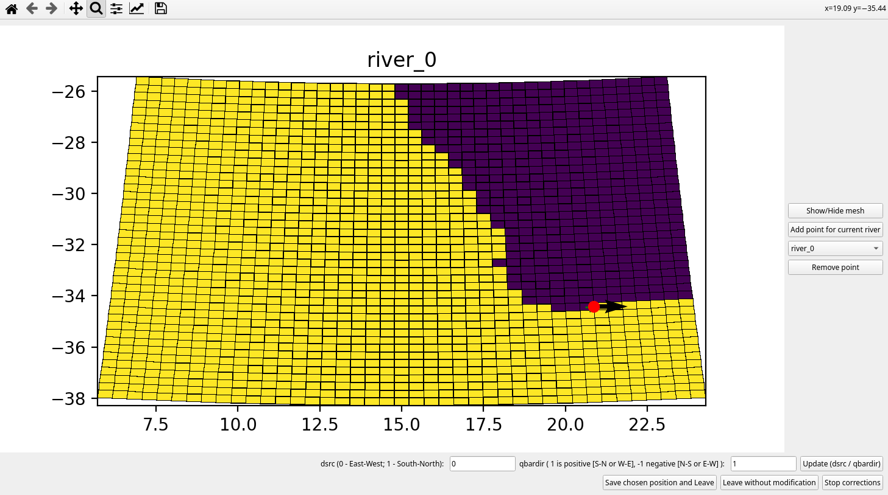

Build CROCO river forcing
-------------------------

Unlike data from global ocean reanalyses, river data are heterogeneous and do not follow the same formalism. 
The ``make_rivers.py`` is a script that attempts to compensate for this lack 
of formalism by being able to read input data from river reanalysis 
(e.g. `CEMS <https://cds.climate.copernicus.eu/cdsapp#!/dataset/cems-glofas-historical?tab=overview>`_),
or observations (e.g. in Europe `Marinesitu <https://marineinsitu.eu/dashboard/>`_).

.. warning::

    Unlike the matlab tool, this script does not allow you to build a river 
    forcing file from a climatology. However, it is possible possible to 
    create a one-year, 365.25-day cycle.

.. note::

    The script is currently unable to manage variations in river temperature 
    and salinity. The cpp key to be used during simulation is 
    ``PSOURCE_NCFILE``. This allows us to take into account only a flow with a 
    default temperature and salinity set in ``croco.in``. 

Input list
^^^^^^^^^^

Unlike previous scripts, ``make_rivers`` does not use a reader to decrypt 
data. This would make the task more complicated, since on a zone, several 
types of data can co-exist. The list of rivers to be taken into account is 
given to the script in a text file following this formalism:
::

  # input_file     |    Lon    |  Lat/Qmin  |
  river.nc            -2.05        47.30
  loire.dat           -2.05        47.30
  Rhone.txt            4.82        43.37
  2ddata.nc             X            10
  
Each column represents, respectively, the river file, the longitude, and the 
latitude of the river mouth. 
The script can also process text data, where each line represents the river flow at a specific date such as::

  1950/01/01 12:00:00 730.000000
  1950/01/02 12:00:00 695.000000
  1950/01/03 12:00:00 675.000000
  1950/01/04 12:00:00 645.000000
  1950/01/05 12:00:00 610.000000
  1950/01/06 12:00:00 600.000000

Each line must follow the format ``YYYY/MM/DD hh:mm:ss Qsrc`` where Qsrc is 
the river flow at the time `YYYY/MM/DD hh:mm:ss`

.. note:: 

    In the case of a netcdf file, the variable containing the river flow must 
    have an element from this list as a unit attribute.
    ``['m3 s-1','m**3 s**-1','m3/s']``.

If the input file is a 2-D reanalysis of a region, and no longitude is 
specified, the code will automatically determine the position of rivers 
meeting the minimum flow condition. In the example above, in the ``2ddata.nc`` line 
we therefore indicate ``X`` for longitude data and ``10 m3/s`` for the 
minimum flow to be considered.

Using make_rivers
^^^^^^^^^^^^^^^^^

Before running ``make_rivers.py``, **USER CHANGES** section needs to be filled. 
There are several parts in it:

  ::

    # Dates
    Yorig = 2013 # year origin of time : days since Yorig-01-01
    Ystart, Mstart = 2013,1   # Starting month
    Yend,   Mend   = 2013,3   # Ending month
  
    # Input data informations
    input_dir = './' # where .txt file can be found
    input_file = 'river_list.txt' # txt file name
  
    # CROCO path and filename informations
    croco_dir = '../../CROCO_FILES/'
    croco_grd = 'croco_grd.nc'
  
    # Rivers file informations
    river_filename = 'croco_runoff.nc' # output will be put in croco_dir by default
    river_file_format = "MONTHLY" # How outputs are split (MONTHLY,YEARLY,FULL)
    rivers_cyl = 0. # if cycle is needed
    rivers_output_frequency = 'DAILY' # output frequency for rivers (HOURLY,DAILY,MONTHLY depending on your data)
  
Origin year, along with starting and ending date are defined.

Informations on the location and name of the text file containing rivers to 
consider.

Informations on where to find CROCO grid.

Informations about river output file. Several format (``river_file_format``) 
are available to specify how to separate data (monthly, yearly files). As river
data may come from several sources, they may not have the same temporal 
distribution and frequency. To co-locate temporally, we need to choose the 
data output frequency by setting ``rivers_output_frequency``.

To use ``make_rivers.py`` do:
::

  python make_rivers.py

.. note:: 

    The river flow components are located on U/V grid points.

The script can open a graphic interface for helping you positionning the rivers after a first 
"guess" made using the input parameters. To use it, simply answer ``yes`` to the question:
::

  Do you want to manually edit river positions using interactive GUI ?: y,[n]

The following interface will show up: 

A loop will be performed on all rivers to adjust the position. Several 
informations are avaible on the plot:

* Green cross: position in the input text file
* Red dot with black arrow: first guess position at land/ocean interface and direction

The basic commands of the window are:

.. list-table::

  * - Zoom in 
    - Magnifying glass on top row
  * - Show/hide mesh
    - Button in right column
  * - Change point position 
    - Right click on the desired cell (Cyan dot)
  * - Change flow direction
    - Lower row
  * - Add a new point for the same river
    - Button in the right column

On the graphical interface, the active point is colored in cyan, while the others 
are colored in green. When adding a new point for the same river, the flow rate 
will be divided by the total number of points, so that each point has the same 
flow rate.

To pass to the next river click on ``Save chosen position and leave``.

After finishing editing river positions, a summury of rivers in the domain can 
be shown by answering ``yes`` to the question 
::
    
    Do you want a summary of the position of the rivers ?: y,[n]

At the end of the script you will have:

* ``croco_runoff.nc`` containing river inputs
* ``for_croco_in.txt`` a text file to copy in ``psource`` section of ``croco.in``
