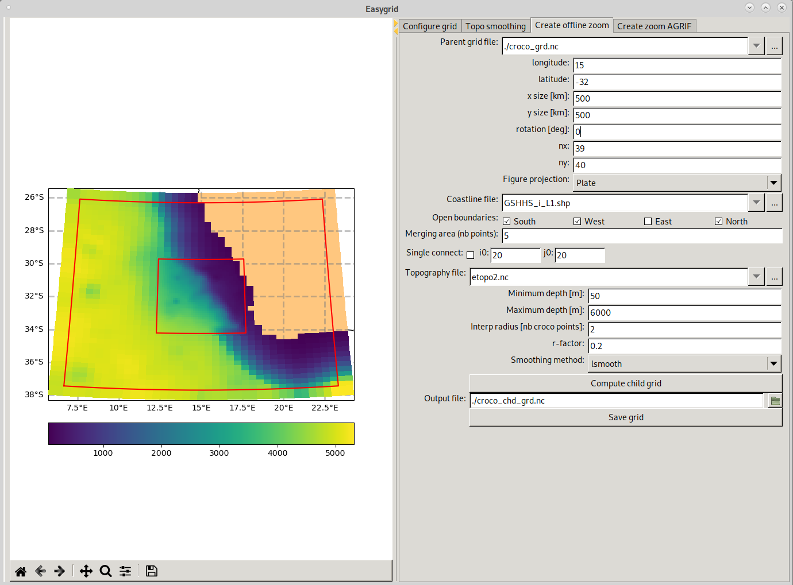
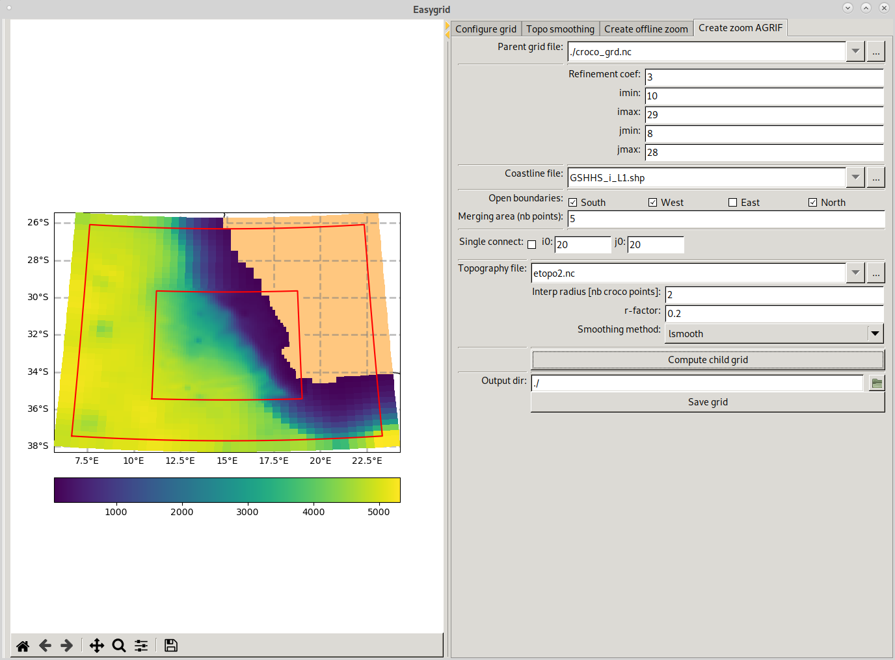

Build a nest
------------

To represent fine-scale phenomena, CROCO offers the ability to create zooms of increased resolution. 
Two options exist:

* **offline zoom**: Creating a grid of the desired resolution, which boundaries are inside a 
  grid from a larger CROCO domain, already modelled. In such case, the higher-resolution grid takes as 
  initialization and boundary conditions, those from the larger CROCO simulation. The simulations are independent
  and no feedback from the higer-resolution grid towards the coarser grid is possible. The simulations run separately. 
  The advantages are: independency, no constraints on the chosen resolution, 
  the drawbacks are: no feedback to the larger domain, boundary forcing of the zoom depends on the frequency of the parent 
  grid's history, which may filter out some of the waves present in the parent grid. 

* **AGRIF zoom**: AGRIF is a library that allows to run CROCO with several embedded domains together. (see documentation in 
  `CROCO documentation <https://croco-ocean.gitlabpages.inria.fr/croco_doc/model/model.nesting.html>`_)
  Parent and child(s) domain are run simultaneously, coupling the domains at the barotropic time step. 
  The advantages are: 2-way feedback to the parent domain is possible and can significantly improve results of the larger domain,
  coupling at the highest possible frequency, consistency of numerics, any number of nesting levels is allowed.
  The drawbacks are: requires to run the parent and child(s) grids simultaneously, nesting ratio should be 3 or 5,  
  in the current state, the AGRIF zooms in CROCO must have the 
  same vertical resolution as the parent.

Child grid creation
^^^^^^^^^^^^^^^^^^^

Offline zoom case
"""""""""""""""""

The child grid creation for offline zoom is made by using the graphic interface's 
third tab of ``make_grid.py``. 

This interface contains the same variables for grid location and topography 
smoothing than that presented in the ``Build CROCO grid`` section. 

The parent grid file location is specified in the first line ``Parent grid file``.

Then grid settings have to be filled. 

``Open boundaries`` and ``Merging area`` help to modifies 
child-grid bottom topography in the vicinity of forced open boundaries to 
exactly match topography interpolated from the parent grid right at the 
boundary, while at the same time, making smooth transition into the interior of 
child-grid domain where the topography is expected to be less smoothed as the resolution
is higher. This topographic match is essential for fluxes conservation.
To apply matching, user needs to tick child open boundaries in ``Open boundaries`` 
line. 
``Merging area`` is an integer number representing the desired width of 
merging zone expressed as the number of child-grid points.

Then choose topo smoothing parameters. 

Click ``Compute grid`` to validate your choices and update the plot. 
If you are happy with the created grid, edit the path and name of the ouptut grid file
and click ``Save grid``.

AGRIF zoom case
"""""""""""""""

AGRIF child grid can be built using the fourth tab of the ``make_grid.py`` graphic 
interface:

To place the child grid inside the parent you need to specify 
the starting and ending index of the parent grid in x-direction 
(``imin``, ``imax``) and y-direction (``jmin``, ``jmax``). 

You also need to specify the refinement coefficient (``Refinement coef``) 
between the parent and the child grid. It should be 3 or 5. 

Choose topo smoothing parameters. 

Click ``Compute child grid`` to validate your choices and update the plot. 

.. note:: 

  AGRIF requires a perfect match of the psi points at boundaries. The procedure to build the AGRIF grid may thus 
  slightly change the grid location or number of points to match this criterion. 
 
If you are happy with the created grid, edit the path of the ouptut directory 
and click ``Save grid``. 

When saving the grid, two files are created: 

* the grid file: ``croco_grd.nc.1``
* a file named ``AGRIF_FixedGrids.in``. This file contains information on the zoom position and refinment
  it is needed by CROCO to run with AGRIF.

.. warning::

    In the current state, the generation of ``AGRIF_FixedGrids.in`` works well when 
    having only one AGRIF zoom, but not with several successive zooms. You may have to edit it "by hand".

Child grid IBC
^^^^^^^^^^^^^^

For AGRIF zoom, only the initial file has to be created. The boundary conditions will be given online by the parent domain. 

For offline zooms, initial and boundary conditions have to be created. 

We have created one script only to create these ibc conditions: ``make_zoom_ibc.py``. This script 
is generally fast as it uses fortran routines in the background.

.. warning:: 

    As this script is using fortran routines, they **must** be compiled. See 
    ``Building the environnement`` section for some help.

To use ``make_zoom_ibc.py``, **USER CHANGES** section needs to be filled:

* **Generic informations**
  ::
    
    prt_grd = 'croco_grd.nc'         # Parent grid file
    chd_grd = 'croco_chd_grd.nc'     # Child grid file
    ts = 6; tb = 4; hc = 75; n = 50  # Child vertical coordinates parameters

    tracers=['temp','salt'] # if no tracers leave empty. string must be 4 or less

In this section you specify the parent and child grid names (respectively 
``prt_grd`` and ``chd_grd``) along with the desired vertical coordinates parameters 
( sigma_surf ``ts``, sigma_bot ``tb``, critical depth ``hc`` and number of levels ``n``,
see `sigma-coordinates <https://croco-ocean.gitlabpages.inria.fr/croco_doc/model/model.grid.html>`_) 
for the child grid.

Several tracers can be specified in ``tracers`` list. Tracer names must be 
four characters long or less.

.. note::

  In AGRIF case, ``ts``, ``tb``, ``hc``, ``n`` need to be the same than parent 
  ini/bry files

* **Initial file**
  ::

    ### Ini file ###
    make_ini = True  # Do you want to build ini file
    prt_his_ini = 'croco_his_20050201_20050205.nc' # History file to use to create the start of the child simulation
    rec = 1          # record index in the prt_his_ini file

Here you indicate if you want to build an initial file for your child grid by 
setting ``make_ini = True``. 

You also need to specify which parent history file to use (``prt_his_ini``) and 
which record to take (``rec``).

.. note::

    ``prt_his_ini`` can also be a CROCO initial file if you are using AGRIF.

* **Boundary file**
  ::

    ### Bry file ###
    make_bry = False  # Do you want to build bry file
    obc_cond = 'SWEN' # First letters of the boundaries that are opened (S=South, W=West, E=East, N=North)
    # list of all the files you desired to build you bry file
    #    can handle all bash sign such as ?,*,[]
    #    the only constraint is that each string may be less than 160 characters
    prt_his_bry = ['croco_his_2005021*','croco_his_2005020?*']

Here you indicate if you want to build a boundary file for your child (only necessary for offline zooms, not
necessary for AGRIF zoom).

Specify the CROCO history files you want to use in ``prt_his_bry`` list. 
To facilitate input selection we use python `glob module <https://docs.python.org/3/library/glob.html>`_ 
which finds all the pathnames matching a specified pattern according to the 
rules used by the Unix shell. 

You also need to specify which boudaries are opened with ``obc_cond``.
Where ``obc_cond`` string should have up to 4 letters (S, W, E, N only, upper 
or lowercase letters for Southern, Western, Eastern, Northern edges) indicating 
which ones have open boundaries.

To use ``make_zoom_ibc.py`` do:
::

  python make_zoom_ibc.py
